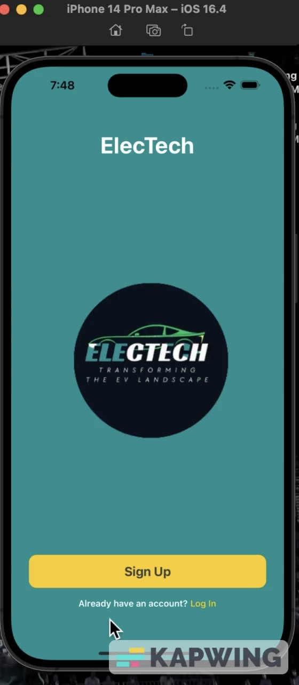
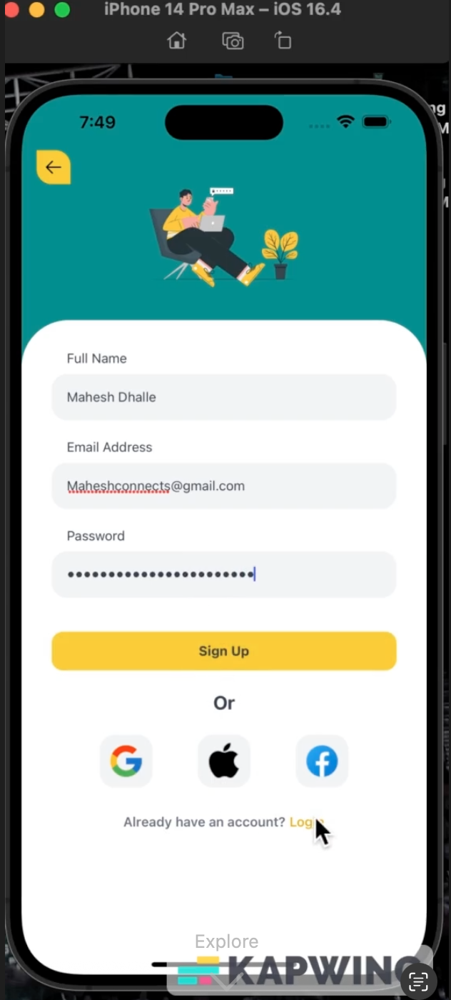
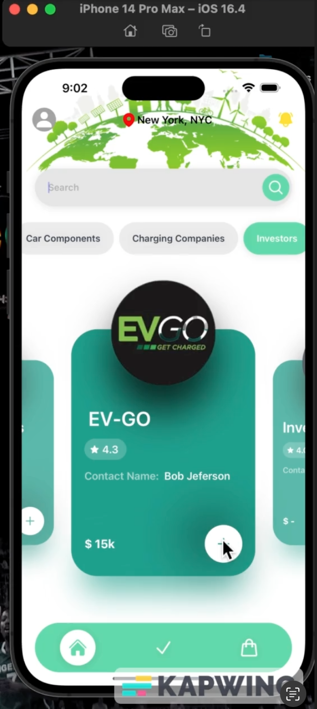
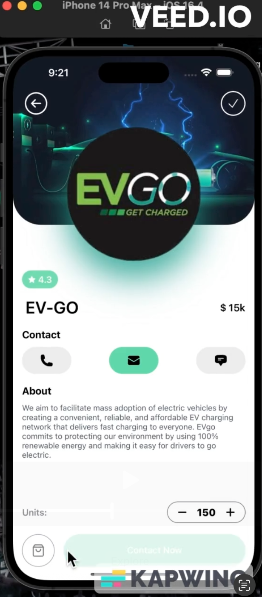
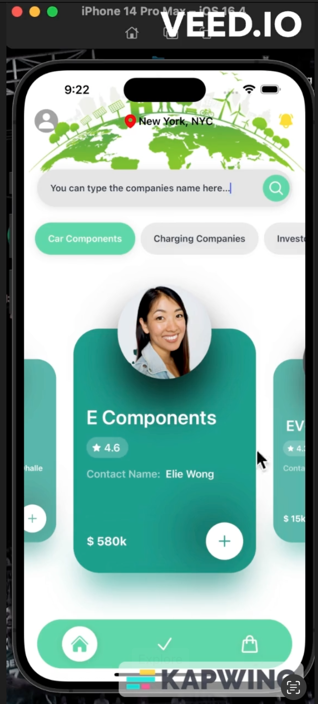

# ⚡ NAAS — ELECTECH APP

A technology-focused project designed to explore how electrical concepts and logical systems can be translated into structured problem solving.  
The app emphasizes breaking down complex real-world systems into understandable and functional components.

---

## Features

- Logical simulation of electrical and technical systems  
- Interactive components to visualize processes  
- Step-by-step explanations for each module  
- User-friendly interface for easy navigation  

---

## Tech Stack

- **Languages:** JavaScript, HTML, CSS  
- **Tools & Libraries:** React Native, Expo

---

## Demo / Screenshots

| Screenshot 1 | Screenshot 2 | Screenshot 3 |
|--------------|--------------|--------------|
|  |  |  |

| Screenshot 4 | Screenshot 5 | Screenshot 6 |
|--------------|--------------|--------------|
|  |  |  |

---
